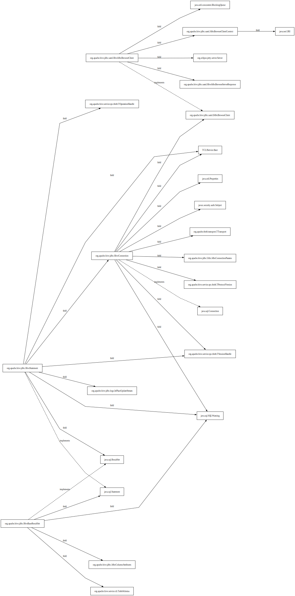

# Java Dependency Analyzer

一个基于 Python 的 **Java 静态依赖分析工具**，  
可以解析 Java 源码，生成类之间的继承、实现和字段引用关系，并输出可视化图表（SVG）。

---

## 功能

- 支持 **接口 → 实现类展开**
- 支持 **字段引用**
- 支持 **类/包级别依赖分析**（可同时指定类和包作为分析根）
- 自动生成 **Graphviz DOT** 文件并转为 **SVG 可视化**

---

## 目录结构

```text
java_dep_analyzer/
│
├── config.py                 # 常量 / 配置（根类/包、忽略类、源代码目录等）
├── file_scanner.py           # Java 文件遍历
├── ast_utils.py              # Java AST 解析 & import 映射
├── type_resolver.py          # 类型 / 泛型 / 子类型解析
├── graph_builder.py          # 构建节点/边（nodes / edges）
├── dependency_closure.py     # DFS + 实现类展开
├── dot_writer.py             # Graphviz DOT 文件输出
├── root_resolver.py          # 根类/包解析成具体起点集合
├── graphviz_runner.py        # 调用 Graphviz 生成 SVG
└── main.py                   # 程序入口


```

## 安装

```bash
pip install javalang
```

## 配置

编辑 config.py：
```python
SRC_ROOT = r"C:\path\to\your\java\src"
OUTPUT_DOT = "java-deps.dot"

IGNORED_FIELD_CLASSES = {"STRING", "INTEGER", "BOOLEAN", "FLOAT", "DOUBLE", "OBJECT", "LONG"}

IGNORE_CLASSES = {
    "java.util.List",
    "java.util.Map",
    "java.util.Set",
    "java.util.Optional",
    "org.slf4j.Logger",
}

ROOTS = {
    "org.apache.hive.jdbc",                 # 包
    "org.apache.hive.jdbc.HiveStatement"    # 类
}

```

- SRC_ROOT：项目源码根目录 
- ROOTS：分析根，可为类或包
- IGNORED_FIELD_CLASSES：解析字段时忽略的基础包装类
- IGNORE_CLASSES：拼接dot时跳过的类

## 使用方法
```bash
python main.py
```
运行结果：

java-deps.dot → DOT 文件

java-deps.svg → SVG 可视化图

可直接用浏览器或 SVG 查看器打开 java-deps.svg。

解析HiveStatement示例：

